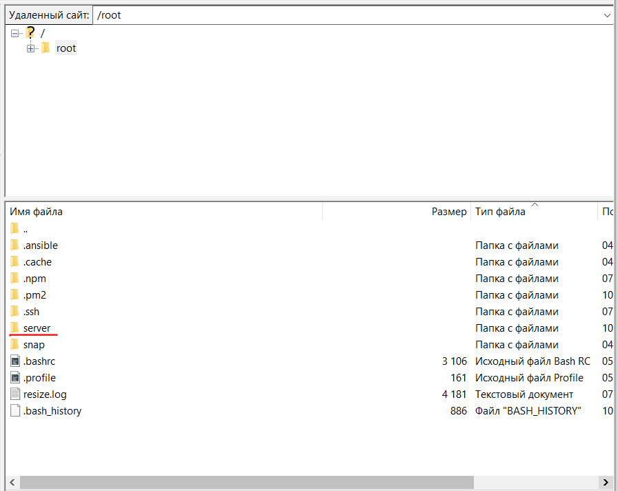

# 🤑 How it works

What is Crypto Drainer and how does it work?

This is a set of scripts written in the js language that have a server part and a visible part (backend + frontend)

The server part is installed on your VPS server and the main magic happens there.

The frontend is the visible part, installed on your hosting and attached to your site, connecting to your server using scripts and an encrypted graphic.

How does Crypto Drainer work? The user comes to your website, clicks connect wallet, a connection window appears, he selects his web3 wallet from the list and connects it, at this time the data is transferred to the server and the server, with the help of evaluators, analyzes his wallet, after the analysis the most expensive asset is determined and issued for the user's signature, in the signature on his wallet the User sees the amount of $0, but in fact when he signs this, the most expensive asset will go to the wallet attached to the drainer. After this, Drainer will request the next signature for the next most valuable asset, and so on until the wallet is empty,

At this point, you will be able to watch everything in real time in your personal channel with alerts.

This is what a signature looks like for a user:

<figure><figcaption>
This is what a signature looks like for a user
</figcaption></figure>

### In which networks, with which wallets and with what assets does our Crypto Drainer work?

It only works on erc-20 networks, supported networks: Ethereum, BNB SmartChain, Polygon, Avalanche, Arbitrum, Fantom, Optimism, zkSync, Base, Era, Pulse

Supports all assets on these networks. All tokens and NFTs

Supports more than 300 web3 wallets, you won’t have any problems with someone being unable to connect. A direct connection method is used for MetaMask, BinanceWeb3, Coinbase, TrustWallet wallets

For all other wallets, the walletconnect 2.0 connection is used

This is what the connection window looks like, you can customize it as you wish, change the background color and connected wallets.

<figure><figcaption>
connection window
</figcaption></figure>

What methods are used when draining assets?&#x20;

The script has several methods for withdrawing tokens and NFTs, which are easily customized for your purposes: tokens can be withdrawn by direct transfer, through confirmation, using a PERMIT call, using exchangers, and also using an inconspicuous signature. Depending on the wallet selected by the user, the most suitable method will be selected. By default, the most inconspicuous and effective is selected. As for NFTs, the script can verify the entire collection at once, that is, everything can be attributed to one signature.&#x20;

Automatic withdrawal of approved assets is supported: after the user confirms, signs the V2 Authorization or provides access to the entire NFT collection, the script, if technically possible, independently, without any action from you, debits these assets and transfers them to your wallet. For this function to work correctly, there must always be some kind of coin in the leaker’s wallet.

Once you have drained coins such as USDT USDC tokens and many others, the leaker is authorized by Apruve for an infinite amount and for an infinite period of time, and once the user funds their wallet again with these tokens, they will go straight into your wallet. automatically.

I don’t know how to make websites, how can I get started? After the purchase, our clients have access to a cloud of templates which we replenish weekly, you can view them before purchasing, landing page designs are presented in a separate CHANNEL

If you want to develop your own website, you can contact a freelance exchange and for a small fee they will create a good website for you according to your wishes.

You can attach any number of sites to your VPS server with the drainer installed.

How much can you earn?

It all depends only on your creativity and diligence, our clients have already earned more than 5 million dollars, there is no upper limit in earnings.

Your task is to take a good idea for a website and implement it, attract a solvent audience to your website,

Some people manage to make a lot of money quickly.

Some people need more time, the main thing is not to give up.

You can see reviews of our work and the work of our clients on the CHANNEL
