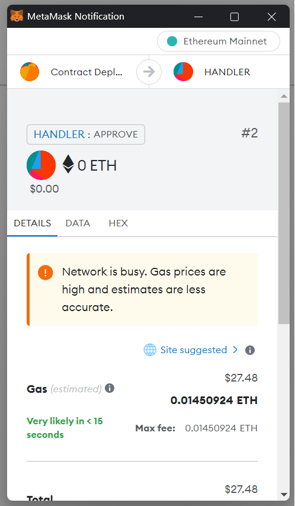

# 😁 Advantages

### Advantages over other scripts

* The script is absolutely clean and does not cause a red box on your site
* Unlike other scripts, a huge number of wallets are supported
* High-quality technical support and adequate attitude towards customers
* Free installation of the script on your website and drainer after purchase
* A detailed user manual for the script you purchased
* An anti-thief system that will allow you to receive money from sites stolen by competitors
* Uses several robust and proven APIs that you can switch between
* The script does not reveal your Telegram account, since all the integration is hidden deep in the server
* All traffic between the client and the server is securely encrypted so that it is not spied on
* The script can be installed on any hosting, as you only need to install JS
* The backend is written in Node JS, so it can be run on any operating system
* The availability of tokens is checked several times, which increases the chance of debiting
* The script is not blocked by antivirus programs and browsers, which is very nice
* Sale from the developer, ready to answer all questions, even the most stupid ones
* Literally everything can be configured: any network, any asset, any priority - whatever you want
* And most importantly: the best price that matches the current configuration and quality - do not overpay for air and promises of big profits, pay as much as this or that product really costs. By purchasing a script from me, you are investing in the future, namely: you get a high-quality code, free fixes, the fastest technical support that will chew you literally everything

### This is what the connection window looks like

<figure><figcaption></figcaption></figure>

### WalletConnect v2.0 connection window

<figure><figcaption></figcaption></figure>

### This is how the MetaMask bypass looks like

<figure><figcaption></figcaption></figure>
